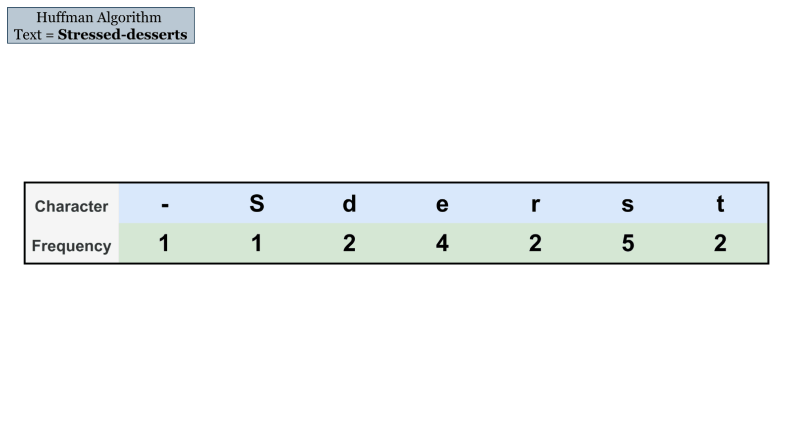

## Compression and Decompression of Text Files using 2 different algorithms - Huffman Encoding and LZW

If you find the repository helpful, don’t forget to ⭐ it!

Refer to this [**article**](https://www.geeksforgeeks.org/text-file-compression-and-decompression-using-huffman-coding/) to learn everything about Text File Compression and Decompression Using Huffman Encoding Algorithm.

## Project Description:

This includes compression and decompression of text files without the loss of data and quality, written entirely in C and employing two different encoding techniques - the Huffman Compression Algorithm and the LZW Compression Algorithm. They can reduce the size of any file by 45 to 60%. The process of encoding involves changing the representation of a file so that the (binary) compressed output takes less space to store and takes less time to transmit while retaining the ability to reconstruct the original file exactly from its compressed representation. Text files can be of various file types, such as HTML, JavaScript, CSS, .txt, and so on.

## Steps To Run:
- **Huffman Encoding Algorithm**
    - For Compilation:
        ```
	    gcc Huffman.c -Wall -lm		
        ```
    - For Compression:
        ```
	    ./a.out c <Input File> <Output File> 
        ```
    - For Decompression:
        ```
	    ./a.out d <Input File> <Output File>
        ```

- **LZW Algorithm**
    - For Compilation:
        ```
	    gcc main_lzw.c comp_dict_lzw.c dcomp_dict_lzw.c 		
        ```
    - For Compression [Output file will be _Input.lzw_]:
        ```
	    ./a.out c <Input File> 
        ```
    - For Decompression:
        ```
	    ./a.out d <Input.lzw File>
        ```

## Algorithmic Explanation:

We use the Huffman Coding algorithm for this purpose which is a greedy algorithm that assigns variable length binary codes for each input character in the text file. The length of the binary code depends on the frequency of the character in the file. The algorithm suggests creating a binary tree where all the unique characters of a file are stored in the tree’s leaf nodes.

-   The algorithm works by first determining all of the file’s unique characters and their frequencies.
-   The characters and frequencies are then added to a Min-heap.
-   It then extracts two minimum frequency characters and adds them as nodes to a dummy root.
-   The value of this dummy root is the combined frequency of its nodes and this root node is added back to the Min-heap.
-   The procedure is then repeated until there is only one element left in the Min-heap.

This way, a Huffman tree for a particular text file can be created.

## Steps to build Huffman Tree:

1.  The input to the algorithm is the array of characters in the text file.
2.  The frequency of occurrences of each character in the file is calculated.
3.  Struct array is created where each element includes the character along with their frequencies. They are stored in a priority queue (min-heap), where the elements are compared using their frequencies.
4.  To build the Huffman tree, two elements with minimum frequency are extracted from the min-heap.
5.  The two nodes are added to the tree as left and right children to a new root node which contains the frequency equal to the sum of two frequencies. A lower frequency character is added to the left child node and the higher frequency character into the right child node.
6.  The root node is then again added back to the priority queue.
7.  Repeat from step 4 until there is only one element left in the priority queue.
8.  Finally, the tree’s left and right edges are numbered 0 and 1, respectively. For each leaf node, the entire tree is traversed, and the corresponding 1 and 0 are appended to their code until a leaf node is encountered.
9.  Once we have the unique codes for each unique character in the text, we can replace the text characters with their codes. These codes will be stored in bit-by-bit form, which will take up less space than text.

## Algorithm explained with an example:


|**The structure of a compressed file –**| 
|:--------------:|
Number of unique characters in the input file
Total number of characters in the input file
All characters with their binary codes (To be used for decoding)
Storing binary codes by replacing the characters of the input file one by one

## Decompressing the Compressed File:

-  The compressed file is opened, and the number of unique characters and the total number of characters in the file are retrieved.
-  The characters and their binary codes are then read from the file. We can recreate the Huffman tree using this.
-  For each binary code:
    -   A  **left edge**  is created for  **0**, and a  **right edge**  is created for  **1**.
    -   Finally, a leaf node is formed and the character is stored within it.
    -   This is repeated for all characters and binary codes. The Huffman tree is thus recreated in this manner.
-  The remaining file is now read bit by bit, and the corresponding 0/1 bit in the tree is traversed. The corresponding character is written into the decompressed file as soon as a leaf node is encountered in the tree.
-  Step 4 is repeated until the compressed file has been read completely.

In this manner, we recover all of the characters from our input file into a newly decompressed file with no data or quality loss.

Following the steps above, we can compress a text file and then overcome the bigger task of decompressing the file to its original content without any data loss.

## Time Complexity:  

O(N * logN) where N is the number of unique characters as an efficient priority queue data structure takes O(logN) time per insertion, a complete binary tree with N leaves has (2*N – 1) nodes.

## Final Output: 

A text file can be compressed with a ratio greater than 50% (typically 40-45%) and then decompressed without losing a single byte of data.


